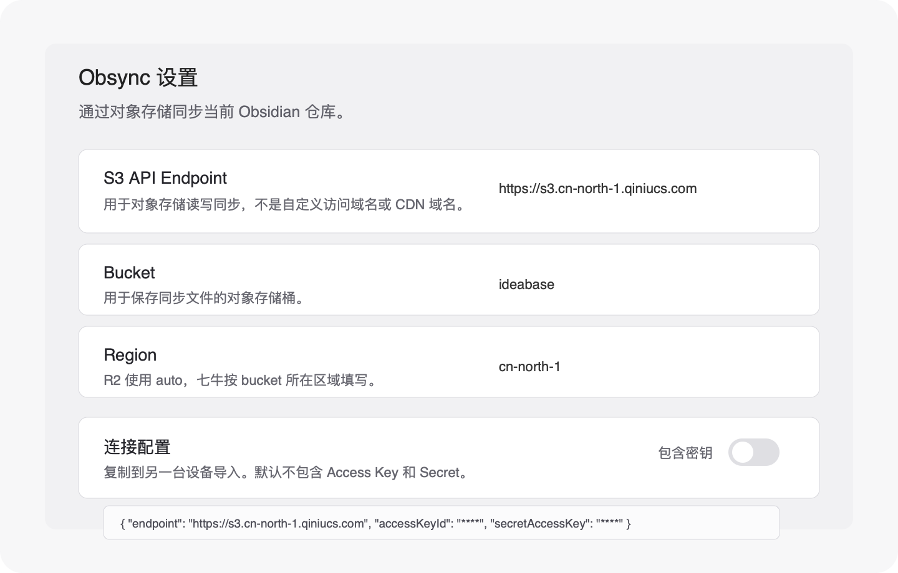

# Obsync

Obsync 是一个 Obsidian 社区插件，用于通过 OSS / S3 兼容对象存储同步当前 vault 文件。



## 当前能力

- 基于 `vaultId` 隔离多笔记仓库
- 基于 `deviceId` 区分多设备
- 支持手动同步和自动同步
- 支持 S3 Signature V4 对象存储
- 支持冲突文件保留
- 支持删除同步和已删除内容清理
- 支持复制 / 导入连接配置
- 可选择导出完整配置，包含 Access Key 和 Secret

详细方案见：[docs/obsidian-oss-sync-mvp.md](docs/obsidian-oss-sync-mvp.md)

## 对象存储端点

同步必须填写服务商的 **S3 API Endpoint**，不要填写自定义访问域名、CDN 域名或私有下载域名。

自定义域名通常用于浏览器访问、公开文件下载或分享链接；同步需要的是 `PUT`、`GET`、`DELETE`、`ListObjects` 和 S3 Signature V4，应使用对象存储服务商提供的 S3 API 入口。

### Cloudflare R2

```text
Endpoint: https://<account-id>.r2.cloudflarestorage.com
Region: auto
Bucket: ideabase
```

Cloudflare R2 同步不需要绑定自定义域名。

### 七牛云

```text
Endpoint: https://s3.cn-north-1.qiniucs.com
Region: cn-north-1
Bucket: ideabase
```

七牛云同步不使用自定义下载域名，例如 `http://oss.example.com`。这类域名可能返回 `download token not specified`，它不是 S3 API endpoint。

## 本地开发

```bash
pnpm install
pnpm test
pnpm run build
```

技术栈：

```text
Vite 8
Vue 3
Tailwind CSS 4
SCSS
TypeScript 6
pnpm
```

构建产物：

```text
dist/main.js
dist/main.css
```

## 本地安装

安装到 Obsidian 时，需要复制：

```text
manifest.json
dist/main.js
dist/main.css
```

到目标 vault 的插件目录，并把 `dist/main.css` 放置为 Obsidian 识别的 `styles.css`：

```text
<vault>/.obsidian/plugins/obsync/
  manifest.json
  main.js
  styles.css
```

也可以使用安装脚本：

```bash
pnpm run build
pnpm install-plugin "/path/to/your-vault"
```

## 插件 ID

```text
obsync
```

## 发布

推送版本 tag 会触发 GitHub Actions 自动发布：

```bash
git tag v0.1.0
git push origin v0.1.0
```

Release 会上传：

```text
manifest.json
main.js
styles.css
```

发布前可以本地检查：

```bash
pnpm run build
pnpm run release:check
```
