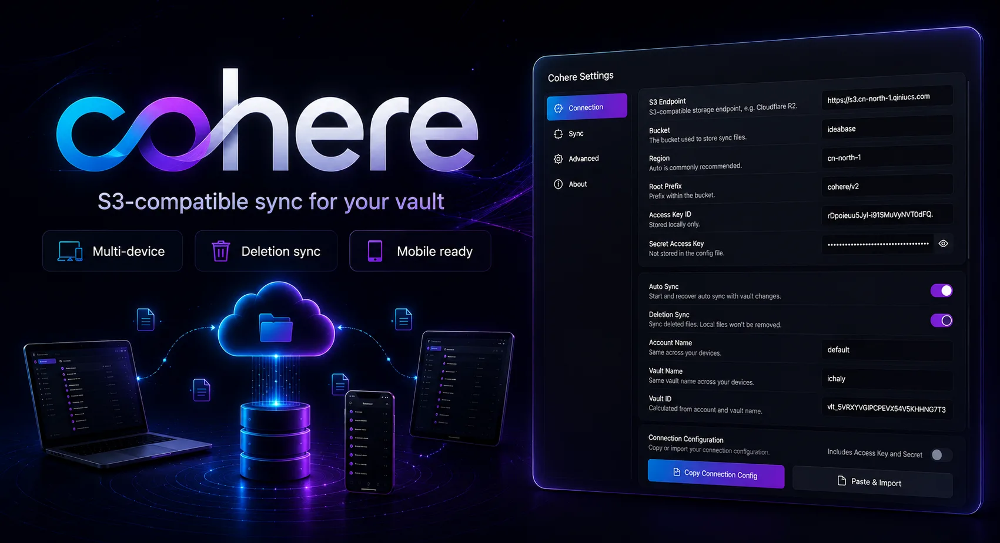

# Cohere

Cohere is a community plugin for syncing vault files through OSS / S3-compatible object storage. It supports manual sync, automatic sync, deletion sync, conflict copies, optional empty directory sync, and connection configuration import/export.

The plugin ID is `cohere`.

## 中文说明

Cohere 用于通过 OSS / S3 兼容对象存储同步当前 vault 文件。



## 当前能力

- 基于 `vaultId` 隔离多笔记仓库
- 基于 `deviceId` 区分多设备
- 支持手动同步和自动同步
- 支持 S3 Signature V4 对象存储
- 支持冲突文件保留
- 支持删除同步和已删除内容清理
- 支持可选同步空目录
- 支持复制 / 导入连接配置
- 可选择导出完整配置，包含 Access Key 和 Secret

详细方案见：[docs/obsidian-oss-sync-mvp.md](docs/obsidian-oss-sync-mvp.md)

## 对象存储端点

同步端点填写服务商提供的 **S3 API Endpoint**。

地址风格默认选择 `自动`。如果服务商明确要求虚拟主机风格地址，请选择 `Virtual Hosted Style`。

### Cloudflare R2

```text
Endpoint: https://<account-id>.r2.cloudflarestorage.com
Region: auto
Bucket: <桶名称>
地址风格: 自动
```

### 阿里云 OSS

```text
Endpoint: https://oss-<region>.aliyuncs.com
Region: oss-<region>
Bucket: <桶名称>
地址风格: Virtual Hosted Style
```

### 七牛云

```text
Endpoint: https://s3.<region>.qiniucs.com
Region: <region>
Bucket: <桶名称>
地址风格: 自动
```

## 本地开发

```bash
pnpm install
pnpm test
pnpm run build
```

技术栈：

```text
Vite 8
Vue 3
Tailwind CSS 4
SCSS
TypeScript 6
pnpm
```

构建产物：

```text
dist/main.js
dist/main.css
```

## 本地安装

本地安装时，需要复制：

```text
manifest.json
dist/main.js
dist/main.css
```

到目标 vault 的插件目录，并把 `dist/main.css` 放置为插件样式文件 `styles.css`：

```text
<vault>/.obsidian/plugins/cohere/
  manifest.json
  main.js
  styles.css
```

也可以使用安装脚本：

```bash
pnpm run build
pnpm install-plugin "/path/to/your-vault"
```

## 插件 ID

```text
cohere
```

## 发布

推送版本 tag 会触发 GitHub Actions 自动发布：

```bash
git tag 0.1.1
git push origin 0.1.1
```

Release 会上传：

```text
manifest.json
main.js
styles.css
```

发布前可以本地检查：

```bash
pnpm run build
pnpm run release:check
```
